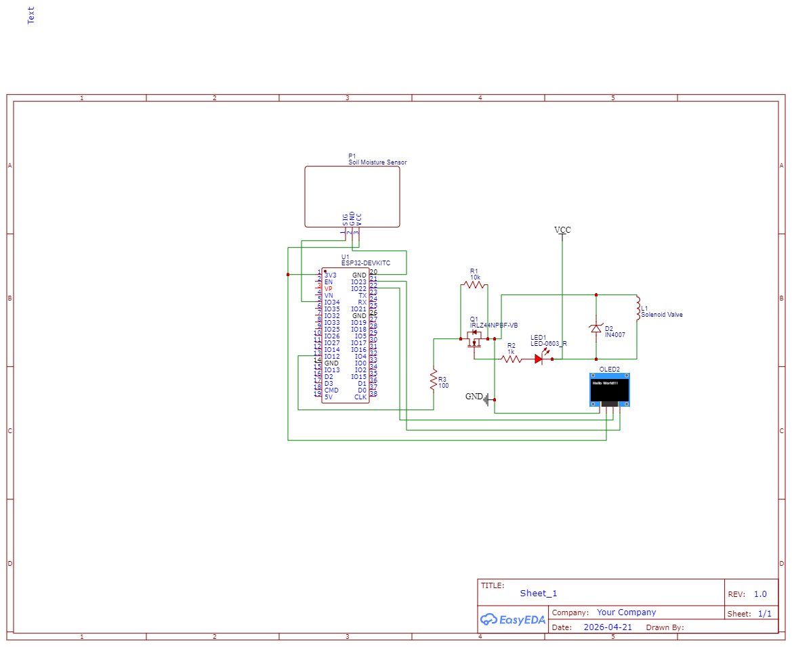

# 🌱 Automated Irrigation System

A full-stack, IoT-integrated smart irrigation system combining an **ESP32 hardware node** with a **Next.js cloud dashboard**. The system autonomously monitors soil moisture, controls a solenoid valve in real time, publishes telemetry to **AWS IoT Core**, and displays live weather data — all managed from a responsive web interface.

---

## ✨ Features

### 🔩 Hardware (ESP32)
- **Live Soil Moisture Sensing:** Capacitive sensor (GPIO 34) with factory-calibrated air/water values for accurate 0–100% readings.
- **Autonomous Valve Control:** The ESP32 independently opens the solenoid valve when moisture drops below **30%** and closes it when it recovers above **60%**, with no cloud dependency.
- **Hex-Based Command Protocol:** Receives structured binary packets from AWS IoT Core (e.g., `1A1B1113` = ValveOn + MotorOn) for remote override.
- **OLED Status Display:** Real-time display of local time (IST), live moisture percentage, solenoid state, and AWS connection status via an SSD1306 128×64 display.
- **IP Geolocation on Boot:** Fetches device latitude/longitude from `ip-api.com` and includes it in every telemetry publish, enabling location-aware weather on the dashboard.
- **NTP Time Sync:** Synchronizes clock with `pool.ntp.org` before connecting to AWS (required for TLS certificate validation).

### ☁️ Cloud & Backend (AWS)
- **AWS IoT Core (MQTT):** Bidirectional communication on topics `esp_32/Node_Response` (publish) and `esp_32/Node_Command` (subscribe).
- **AWS DynamoDB:** Stores real-time telemetry in the `IrrigationStatus` table, consumed by the dashboard API.
- **AWS Lambda** *(pipeline)*: Bridges IoT Core messages to DynamoDB for persistent storage.
- **Remote Valve/Motor Control API (`POST /api/control`):** Publishes hex command packets to the ESP32 via IoT Data Plane.

### 🖥️ Web Dashboard (Next.js)
- **Live Moisture Gauge:** Animated gauge component polling the status API, reflecting the latest DynamoDB reading.
- **Irrigation Status Card:** Displays pump/valve state derived from the hex telemetry payload.
- **Remote Zone Control:** Start/Stop irrigation remotely; commands are translated to hex packets and published to AWS IoT.
- **Live Weather Widget:** Fetches temperature, humidity, UV index, wind speed, and weather condition via the Open-Meteo API — coordinates are sourced from the ESP32's geolocation payload or fallback env vars.
- **Moisture History View:** Historical moisture trend per zone (`/dashboard/history`).
- **Crop Configuration:** Manage min/max moisture thresholds per crop/zone (`/dashboard/crops`).
- **Dashboard Settings:** User preferences and system configuration (`/dashboard/settings`).
- **Login Page:** Secure entry point redirecting to the authenticated dashboard.
- **Dark/Light Theme Toggle:** System-aware theme with manual override.

---

## 🔗 How It All Connects — AWS Architecture

AWS is the central nervous system that bridges the physical hardware and the web dashboard. Here is the complete data flow for both directions:

### 📡 Telemetry Flow — ESP32 → Dashboard

```
Soil Moisture Sensor
        │  (analog read every 5s)
        ▼
    ESP32 Firmware
        │  publishMessage() → JSON { noded: ["1A1D3F"], lat, lon }
        │  MQTT over TLS (port 8883)
        ▼
  AWS IoT Core
  Topic: esp_32/Node_Response
        │  IoT Rule triggers automatically
        ▼
  AWS Lambda Function
        │  Decodes hex payload, extracts moisture %
        │  Writes record to DynamoDB
        ▼
  AWS DynamoDB
  Table: IrrigationStatus
        │  Polled every few seconds
        ▼
  Next.js API Route
  GET /api/status  (reads DynamoDB via AWS SDK)
        │
        ▼
  Web Dashboard
  MoistureGauge + IrrigationStatus components update live
```

### 🎛️ Control Flow — Dashboard → ESP32

```
User clicks "Start Irrigation" on the dashboard
        │
        ▼
  Next.js API Route
  POST /api/control  { zone, command: "START_WATER" }
        │  Builds hex packet: 1A 1B 11 13 15
        │  AWS SDK (IotData.publish)
        ▼
  AWS IoT Core
  Topic: esp_32/Node_Command
        │  Delivered via MQTT subscription
        ▼
    ESP32 Firmware
  callback() parses packet bytes:
    0x11 → digitalWrite(VALVE_PIN, HIGH)
    0x13 → digitalWrite(PUMP_PIN, HIGH)
    0x15 → publishMessage() (immediate moisture response)
        │
        ▼
  Solenoid Valve + Water Pump physically activate
```

### 🌦️ Weather Flow — ESP32 Location → Dashboard

```
ESP32 boots → fetchGeoLocation() via ip-api.com
        │  lat/lon included in every MQTT publish
        ▼
  Lambda writes lat/lon to DynamoDB alongside moisture
        │
        ▼
  Next.js dashboard reads coordinates from /api/status
        │  Passes them to /api/weather?lat=...&lon=...
        ▼
  Open-Meteo API (free, no key needed)
        │  Returns temperature, humidity, UV index, wind speed
        ▼
  Weather Widget on dashboard renders live conditions
  for the exact location of the irrigation node
```

### AWS Services Summary

| AWS Service | Role in this project |
|---|---|
| **IoT Core** | Authenticates the ESP32 via mTLS certificates; routes MQTT messages via IoT Rules |
| **IoT Rules** | Triggers Lambda automatically whenever ESP32 publishes to `esp_32/Node_Response` |
| **Lambda** | Serverless function that decodes the hex telemetry payload and writes structured data to DynamoDB |
| **DynamoDB** | Persistent store for the `IrrigationStatus` table; polled by the Next.js status API |
| **IoT Data Plane** | Used by the Next.js control API to publish command packets back down to the ESP32 |
| **IAM** | Scoped credentials in `.env.local` grant the web app read access to DynamoDB and publish access to IoT |

---

## 🛠️ Tech Stack

| Layer | Technology |
|---|---|
| **Frontend** | Next.js 15 (App Router), React 19, Tailwind CSS v4, Framer Motion, Lucide React |
| **Cloud** | AWS IoT Core (MQTT/TLS), AWS DynamoDB, AWS SDK v2 (`aws-sdk`) |
| **Weather** | [Open-Meteo API](https://open-meteo.com/) (free, no key required) |
| **Firmware** | Arduino C++ (ESP32), PubSubClient, ArduinoJson, Adafruit SSD1306/GFX, WiFiClientSecure |
| **Tooling** | TypeScript, ESLint, PostCSS |

---

## 📐 Hardware

### Circuit Components
| Component | Role |
|---|---|
| ESP32 (DOIT DevKit) | Main microcontroller |
| Capacitive Soil Moisture Sensor | Reads analog moisture (GPIO 34) |
| IRLZ44N MOSFET | Drives the solenoid valve (GPIO 12) |
| Solenoid Valve | Physical water on/off control |
| Water Pump (relay-driven) | Pumps water (GPIO 13) |
| 0.96" OLED (SSD1306 I2C) | Local status display (SDA=21, SCL=22) |

### Schematic


### Sensor Calibration
```cpp
const int AIR_VAL   = 2600;  // Dry air ADC reading
const int WATER_VAL = 1440;  // Saturated soil ADC reading
```

### Hex Command Protocol
Commands from the dashboard are encoded as multi-byte hex strings:

| Byte | Meaning |
|---|---|
| `1A` | Node ID |
| `1B` | Message Type: Command |
| `11` | ValveOn |
| `12` | ValveOff |
| `13` | MotorOn |
| `14` | MotorOff |
| `15` | MoistureRequest |

**Example — Start Water:** `1A1B111315` → Target Node `0x1A`, Command type, Valve ON + Motor ON + Request moisture reading.

---

## 🚀 Getting Started

### Prerequisites
- Node.js v20+
- Arduino IDE with ESP32 board support
- AWS Account with:
  - **IoT Core** Thing (`esp32-irrigation-node`) with certificates
  - **DynamoDB** table named `IrrigationStatus`
  - **Lambda** function routing IoT messages to DynamoDB

### 1. Clone & Install (Web Dashboard)

```bash
cd irrigation-system
npm install
```

### 2. Configure Environment Variables

Create `irrigation-system/.env.local`:
```env
# AWS Credentials (IAM user with DynamoDB + IoT permissions)
AWS_REGION=ap-south-1
AWS_ACCESS_KEY_ID=your_access_key_id
AWS_SECRET_ACCESS_KEY=your_secret_access_key

# AWS IoT Core endpoint (for remote control API)
NEXT_PUBLIC_AWS_IOT_ENDPOINT=your-endpoint.iot.ap-south-1.amazonaws.com

# Weather fallback coordinates (used if ESP32 geolocation is unavailable)
WEATHER_LAT=12.9716
WEATHER_LON=77.5946
```

### 3. Flash ESP32 Firmware

1. Open `hardware/esp32/esp32.ino` in Arduino IDE.
2. Edit `hardware/esp32/secrets.h` with your Wi-Fi credentials and AWS IoT certificates.
3. Install required libraries via Arduino Library Manager:
   - `PubSubClient`
   - `ArduinoJson`
   - `Adafruit SSD1306`
   - `Adafruit GFX Library`
4. Select board **DOIT ESP32 DEVKIT V1** and upload.

### 4. Run the Development Server

```bash
cd irrigation-system
npm run dev
```

Open [http://localhost:3000](http://localhost:3000) — the root page redirects to `/login`, then to `/dashboard`.

---

---

## 📂 Project Structure

```
automated-irrigation/
├── hardware/
│   ├── esp32/
│   │   ├── esp32.ino          # Main ESP32 firmware
│   │   └── secrets.h          # Wi-Fi & AWS IoT credentials (git-ignored)
│   ├── test_prototype/        # Early prototyping sketches
│   └── Schematic_New-Project_2026-04-21.png  # Circuit schematic
│
└── irrigation-system/         # Next.js web application
    ├── src/
    │   ├── app/
    │   │   ├── page.tsx            # Root redirect to /login
    │   │   ├── login/              # Login page
    │   │   ├── dashboard/
    │   │   │   ├── page.tsx        # Main dashboard UI
    │   │   │   ├── layout.tsx      # Dashboard layout & nav
    │   │   │   ├── crops/          # Crop threshold configuration
    │   │   │   ├── history/        # Moisture history view
    │   │   │   └── settings/       # System settings
    │   │   └── api/
    │   │       ├── status/         # GET  – fetch DynamoDB telemetry
    │   │       ├── control/        # POST – publish hex commands to IoT Core
    │   │       ├── history/        # GET  – historical moisture records
    │   │       ├── weather/        # GET  – Open-Meteo weather proxy
    │   │       ├── irrigate/       # Irrigation trigger endpoint
    │   │       └── config/         # Zone/crop config endpoint
    │   ├── components/
    │   │   ├── MoistureGauge.tsx   # Animated circular gauge
    │   │   ├── IrrigationStatus.tsx # Pump/valve status card
    │   │   ├── theme-provider.tsx  # Dark/light theme context
    │   │   └── theme-toggle.tsx    # Theme toggle button
    │   ├── lib/
    │   │   ├── types.ts            # Shared TypeScript interfaces
    │   │   └── services/
    │   │       └── irrigationService.ts  # AWS service abstraction
    │   └── context/               # React context providers
    └── .env.local                 # Secret keys (git-ignored)
```

---

## 🔒 Security Notes

- `hardware/esp32/secrets.h` contains Wi-Fi credentials and AWS IoT certificates — it is **git-ignored** and must never be committed.
- `.env.local` contains AWS IAM access keys — it is **git-ignored**.
- The `aws certificate keys/` directory is also **git-ignored**.

---

*Built as an end-to-end IoT project integrating embedded C++ firmware, AWS cloud services, and a modern React web dashboard.*
